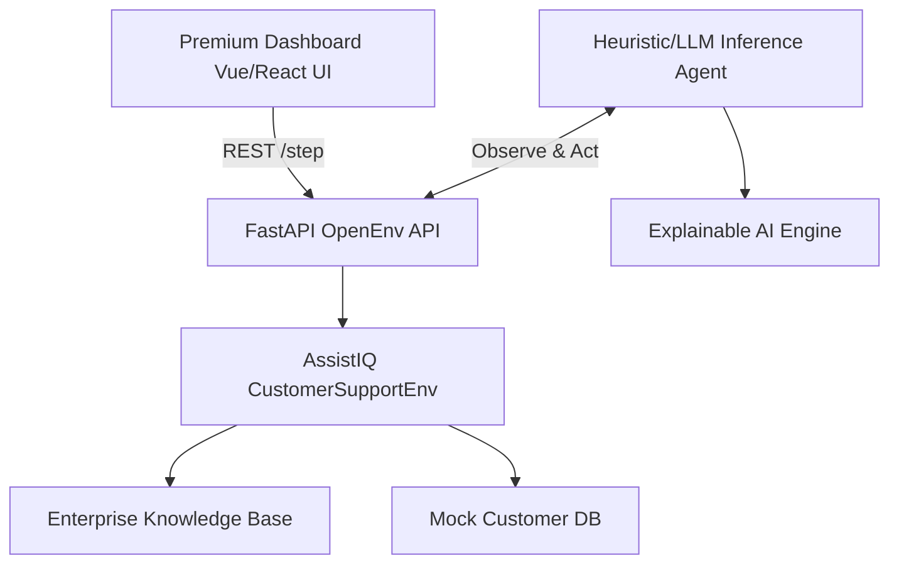

# AssistIQ: Enterprise AI Customer Support Simulator

<div align="center">
  
  
  
  
</div>

<br />

**AssistIQ** is a production-grade, OpenEnv-compatible RL environment simulating complex, multi-step enterprise AI customer support operations. Built for high-stakes reinforcement learning, it bridges the gap between simple chatbots and real-world Level-3 Support Command Centers.

---

## 🎯 Problem Statement
In real-world enterprise support, agents don't just "reply to chats." They classify intents, look up secure knowledge base policies, query databases, execute API hotfixes, and decide when to escalate angry Enterprise clients to Level-2 managers or Level-3 on-call engineers.

Most existing RL environments fail to capture this operational complexity, multi-step dependency, and strict policy adherence required in production.

## 🚀 Real-World Impact
**AssistIQ** provides a realistic proving ground for Autonomous Operations Agents. By penalizing hallucinations and redundant actions while rewarding strict sequence adherence and explainable reasoning, it trains models to act securely. An agent trained here is ready to be deployed to an actual Enterprise Jira/Zendesk backend.

---

## 🏗 Architecture



---

## ✨ Features & Upgrades
- **Advanced Task Design (Easy, Medium, Hard)**: Spanning simple classifications to critical multi-step Level-3 escalations with angry customer simulated tones.
- **Strict, Multi-Criteria Reward Function**: Correctness (+0.3), Efficiency Bonus (+0.2), Hallucination Penalty (-0.2), Redundancy Penalty (-0.1).
- **Dynamic Inference Agent**: Implements an episodic memory-bank to prevent loop failures and generates realistic "thought-processes" mimicking advanced LLM chains of thought.
- **Explainable AI (XAI) Panel**: Shows real-time Confidence Scores, Decision Path Engine selections, and Policy Trigger logs.
- **Multi-Language Engine**: Mock translation engine supporting US English, Spanish, French, and Japanese natively in the UI.
- **Premium Glassmorphism UX**: State-of-the-art UI with pulsing timeline events, syntax-highlighted logs, and responsive charts.

---

## 🛠 Example Workflow (Hard Task)
1. **[OBSERVATION]** Angry ticket from Gordon Ramsay (Enterprise Tier): *"SYSTEM KEEPS CRASHING!"*
2. **[AGENT THOUGHT]** `Noting the customer's Angry tone to tread carefully. Applying Enterprise SLA rules.`
3. **[ACTION]** `classify_ticket` → (Reward: +0.3)
4. **[ACTION]** `lookup_customer` → (Reward: +0.3)
5. **[ACTION]** `generate_response` (Empathetic) → (Reward: +0.3)
6. **[ACTION]** `escalate_to_l2` as per strict policy → (Reward: +0.2)
7. **[ACTION]** `confirm_resolution` → (Task complete, Efficiency Bonus +0.2 Applied)

---

## 💻 Running the Simulator

Ensure you have Python 3.9+ installed.

### 1. Install Dependencies
```bash
pip install -r requirements.txt
```

### 2. Launch the Server
```bash
python -m uvicorn app.main:app --host 127.0.0.1 --port 7860
# or if using Docker:
docker build -t assistiq . && docker run -p 7860:7860 assistiq
```

### 3. View the Premium Dashboard
Open your browser to `http://localhost:7860`. You will see the beautiful command center.

### 4. Run the Inference Agent
In a separate terminal, launch the agent to watch it solve the tasks in real-time.
```bash
python inference.py
```

---
*Built for the OpenEnv Hackathon.*